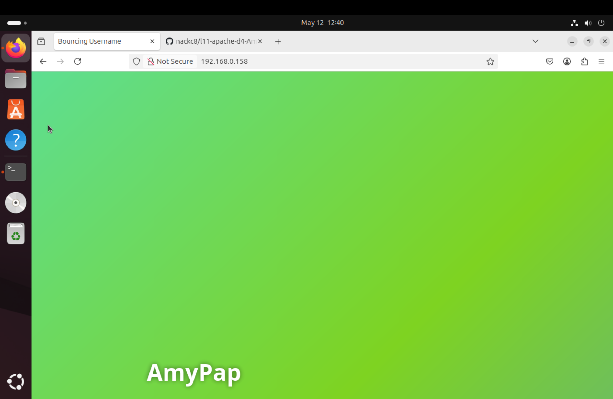
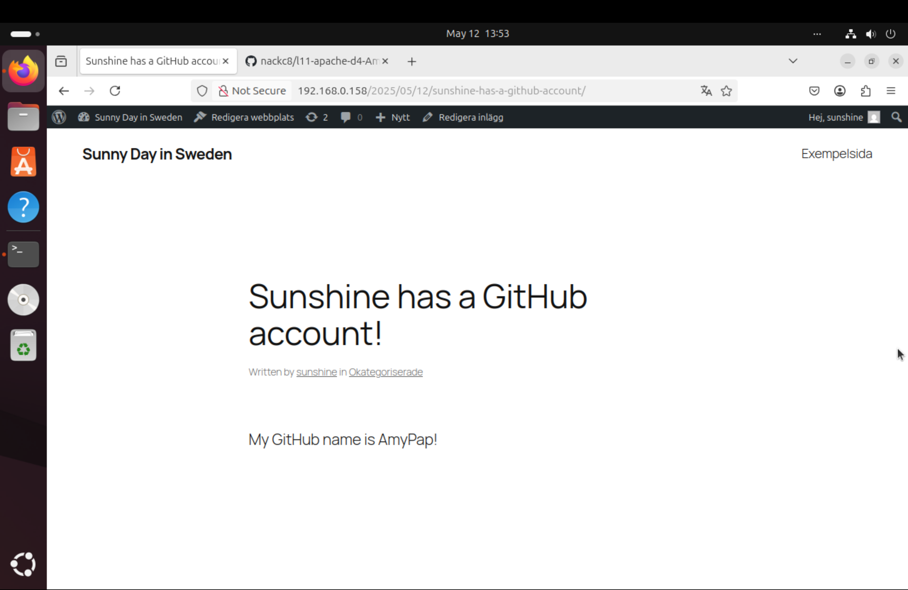

# Apache HTTP Server – Grunddel

## Använda virtuella maskiner

I arbetet använde jag VMware där jag installerade två virtuella maskiner: en med Ubuntu Server och en med Ubuntu Desktop. Jag följde instruktionerna från Lektion 10 för att installera Ubuntu Server.

En viktig del var att säkerställa att båda virtuella maskinerna befann sig på samma lokala nätverk (LAN), så att de kunde kommunicera med varandra. Jag kontrollerade serverns IP-adress med kommandot:

```
hostname -I
```

Serverns IP-adress var **192.168.0.158** vilket jag använde senare i webbläsaren.

## Installera Apache

Jag började med att uppdatera paketlistan så att jag kunde hämta de senaste versionerna av program:
```
sudo apt update
sudo apt install apache2
```
Jag kontrollerade att Apache kördes korrekt med:
```
sudo systemctl status apache2
```
Tjänsten var redan aktiv (active (running)), vilket betyder att installationen startade Apache automatiskt.

## Testa webbserver från klienten

För att kontrollera att Apache fungerade korrekt, öppnade jag webbläsaren på Ubuntu Desktop och skrev in serverns IP-adress:

- http://192.168.0.158

Jag såg den standardmässiga "It works!"-sidan från Apache, vilket bekräftade att webbservern fungerade.

## Apache Loggfiler

För att kontrollera att Apache fungerade korrekt och att inga fel uppstod, tittade jag i loggfilerna med:
```
sudo tail /var/log/apache2/access.log
```
Det visade HTTP-förfrågningar från IP-adressen 192.168.0.159, vilket bekräftade att klienten anslöt till servern.  
```
sudo tail /var/log/apache2/error.log
```
Det visade inga kritiska fel, bara vanliga varningar som t.ex. 'Could not reliably determine the server's fully qualified domain name', vilket inte påverkar funktionaliteten.


## Byta ut index.html

Jag gick tillbaka till servern och klonade mitt GitHub-repo med:
```
git clone https://github.com/AmyPap/l11-apache-d4-AmyPap.git
```
För att undvika konflikt med standardfilen, gjorde jag först en säkerhetskopia och raderade sedan index.html filen:
```
sudo cp /var/www/html/index.html /var/www/html/index.html.bak
sudo rm /var/www/html/index.html
```
Därefter kopierade jag över index.html från mitt repo:
```
sudo cp ~/l11-apache-d4-AmyPap/index.html /var/www/html/index.html
```
Jag öppnade filen med en texteditor för att ersätta Username med mitt GitHub-användarnamn:
```
sudo nano /var/www/html/index.html
```
Jag sparade ändringarna och gick tillbaka till Ubuntu Desktop. Där öppnade jag webbläsaren igen och skrev in samma IP-adress som tidigare för att se den uppdaterade webbsidan.



# Wordpress - Bonusdel

## Installera MariaDB

För att kunna installera WordPress behövde jag först en databas. Jag valde att använda **MariaDB**, som jag har arbetat med tidigare.

Jag började med att uppdatera paketlistan och installera databasservern:

```
sudo apt update
sudo apt install mariadb-server
```
Sedan kontrollerade jag att tjänsten kördes:
```
sudo systemctl status mariadb
```
Tjänsten var redan aktiv *(active (running))*, så jag behövde inte starta eller aktivera den manuellt med start och enable.

Jag gick in i MariaDB med:
```
sudo mariadb
```
Där skapade jag en databas och en användare för WordPress:
```
CREATE DATABASE wordpress_database;
CREATE USER 'amy'@'localhost' IDENTIFIED BY '****';
GRANT ALL PRIVILEGES ON wordpress_database.* TO 'amy'@'localhost';
FLUSH PRIVILEGES;
EXIT;
```

## Installera PHP och nödvändiga paket

Jag följde instruktionerna från Ubuntu tutorials-sidan för att ladda ner och installera WordPress.(https://ubuntu.com/tutorials/install-and-configure-wordpress#1-overview) Enligt tutorial , för att WordPress ska fungera behövs PHP och några tillägg. Jag installerade dem med:

```
sudo apt install php libapache2-mod-php php-mysql php-curl php-gd php-xml php-mbstring php-zip
```

## Ladda ner och installera WordPress

Först skapade jag en katalog och gav Apache(user www-data) rättigheter (user=rwx,group=r-x,others=r-x):
```
sudo mkdir -p /srv/www
sudo chown www-data: /srv/www
sudo chmod 755 /srv/www
sudo ls -ld /srv/www
```

Sedan laddade jag ner WordPress och packade upp det direkt som användaren www-data:
```
curl https://wordpress.org/latest.tar.gz | sudo -u www-data tar zx -C /srv/www
```

## Konfigurera Apache för WordPress

Jag skapade en ny Apache-konfiguration för att peka på WordPress-katalogen:
```
sudo nano /etc/apache2/sites-available/wordpress.conf
```
Med innehållet:
```
<VirtualHost *:80>
    DocumentRoot /srv/www/wordpress
    <Directory /srv/www/wordpress>
        Options FollowSymLinks
        AllowOverride Limit Options FileInfo
        DirectoryIndex index.php
        Require all granted
    </Directory>
    <Directory /srv/www/wordpress/wp-content>
        Options FollowSymLinks
        Require all granted
    </Directory>
</VirtualHost>
```
Jag aktiverade den nya WordPress-sajten och modulen för rewrite som krävs för permalänkar:

```
sudo a2ensite wordpress
sudo a2enmod rewrite
```
Sedan inaktiverade jag den gamla standardsajten och laddade om Apache:
```
sudo a2dissite 000-default
sudo systemctl reload apache2
```
## Ansluta WordPress till databasen

Jag gick till WordPress-mappen:
```
cd /srv/www/wordpress
```
Sedan kopierade jag och redigerade konfigurationsfilen:
```
sudo cp wp-config-sample.php wp-config.php
sudo nano wp-config.php
```
Jag ändrade följande rader för att koppla WordPress till databasen:
```
define( 'DB_NAME', 'wordpress_database' );
define( 'DB_USER', 'amy' );
define( 'DB_PASSWORD', '***' );
define( 'DB_HOST', 'localhost' );
```
### Säkerhetsnycklar i wp-config.php

För att förbättra säkerheten i WordPress konfigurationsfilen, ersatte jag de fördefinierade nycklarna (AUTH_KEY, SECURE_AUTH_KEY, SALTs osv) med nya, unika värden.

Jag använde den officiella tjänsten från WordPress:

[https://api.wordpress.org/secret-key/1.1/salt/](https://api.wordpress.org/secret-key/1.1/salt/)

Dessa nycklar används för att kryptera cookies, autentisering och sessionsdata. Genom att generera och klistra in egna unika värden blir installationen säkrare, eftersom det blir mycket svårare för angripare att förfalska inloggningssessioner.

## Mariadb Loggfiler

Jag försökte först hitta loggfiler i **/var/log**, men MariaDB skrev inga loggar där. På nyare Ubuntu-versioner används systemd journal istället för traditionella **log**-filer.

Så jag använde följande kommando:
```
sudo journalctl -u mariadb
```
Loggen visade att databasservern startade utan fel, använde **127.0.0.1** för anslutningar, och att nedstängning utfördes korrekt. Exempel på loggmeddelanden:

- ready for connections
- shutdown complete

## Slutlig installation i webbläsaren

Till sist gick jag till Ubuntu Desktop och öppnade webbläsaren. Jag skrev in serverns IP-adress:

- http://192.168.0.158

WordPress installationssida visades. Jag fyllde i information och skapade ett inlägg med mitt GitHub-användarnamn AmyPap.


